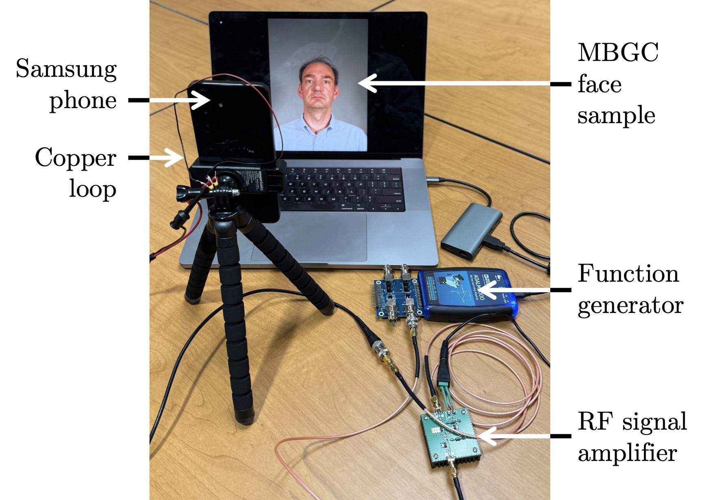
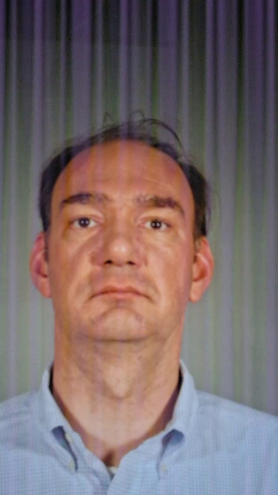

<p align="center">
  
  <h1 align="center">Spectral Vulnerability: Physical RF Attacks on Face Recognition backbones</h1>
</p>

<p align="center">
  
  
  
  
</p>

---

## 📌 Abstract
Attacks on computer vision systems and algorithms are too often relegated to the digital domain. Their optimization performed purely in the digital world and translated to physical mediums for implementation. In the field of biometrics, including facial recognition (FR), physical attacks targeting biometric sensors present significant opportunity and risk. This paper highlights a critical vulnerability in the physical-to-digital pipeline of biometric sensors and provides a standardized metric-based approach for testing facial recognition system robustness against hardware attacks, going beyond well-known presentation attacks (as defined in ISO/IEC 30107), focused on intentional electromagnetic interference and possible to be conducted with commonly accessible radio frequency (RF) equipment. Additionally, we propose (and offer the source codes of) a technique modeling the electromagnetic-induced interferences, which can be used as one of the data augmentation techniques for training face recognition models offering higher robustness against radio frequency hardware attacks. The authors obtained the permission of the original dataset owners to share the re-captured clean and under-attack face videos along with this paper to serve as the RF test benchmark.

## 📀 Dataset
The dataset will be released if the paper is accepted. 

## 🧪 Key Findings
| Model | Params | Susceptibility | Primary Vulnerability |
| :--- | :--- | :--- | :--- |
| ** ** |   | **Low** |   |
| ** ** |   | **High** |   |

## 🖼️ Visual Analysis
### Time-Domain vs Frequency-Domain Impact
Below is a single identity shown without perturbations, modeled attack, and physical attack. Notice the distinct vertical lines in the attacked images, caused by the attack.

<p align="center">
  
  
  
  <br>
  <i>(a) Clean Image, (b) Modeled Attack, (c) Physical Attack FFT</i>
</p>

---

## 🚀 Getting Started

### 1. Requirements
- Linux / Windows / macOS
- Python 3.9+
- CUDA (optional, but recommended)

### 2. Scripts
There are only two scripts necessary for the IEMI Modeling. 
- RF_Optimization.py: Runs a grid search over provided parameters to determine theoretically optimal RF settings per model (models built in same as IJCB paper).
- RF_effect_modeling: Using the outputs from RF_Optimization.py, the script overlays the desired RF parameters (frequency, amplitude, bar angle, AM effect, FM effect) onto a directory of images. 

### 2. Installation
```bash
git clone [https://github.com/YourAnonUser/Project.git](https://github.com/YourAnonUser/Project.git)
cd Project
pip install -r requirements.txt


